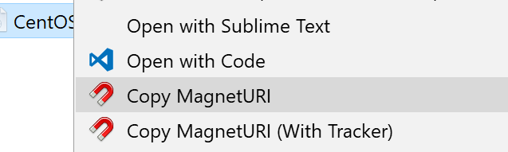
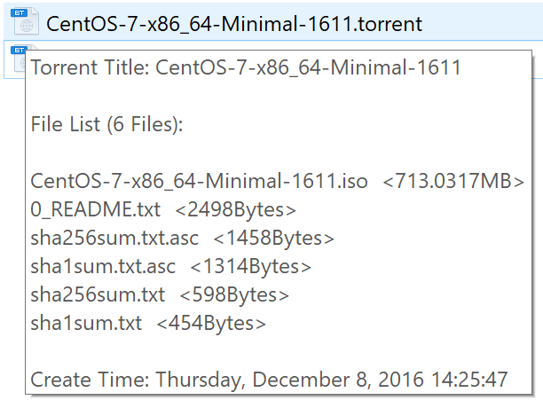

TorrentParser
=============================
This is a simple torrent parser, u can get some torrent info like `torrent title` `torrent announce list` or something else.

## How to use?

### TorrentParser
This just a sample project, u can clone this repository and compile it, drag a .torrent file on TorrentParser.exe .

### TorrentParserShell
This is a ShellExtension project use [SharpShell](https://github.com/dwmkerr/sharpshell) this is an awesome project!
You can compile it and find the 'install.cmd' in Release(or Debug) folder, right click and "Run as administrator"